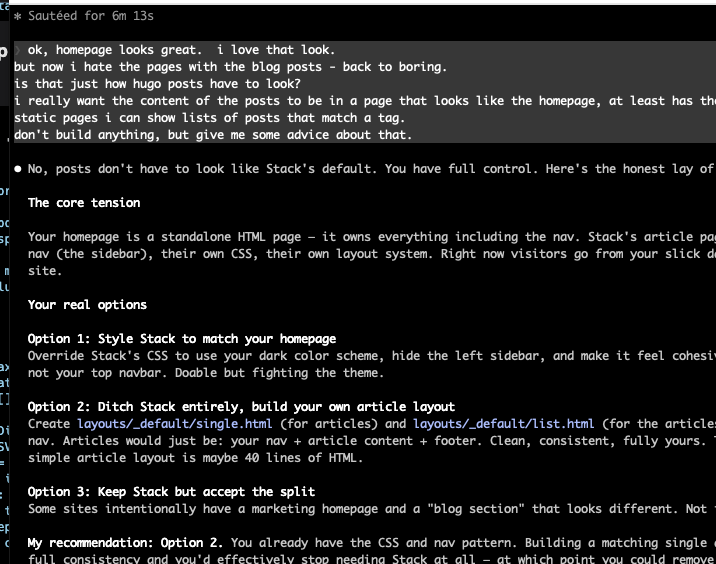

I know 'creating a website' is something that AI tools have been able to do from the very start - kind of a canonical example of what AI can do for any organization.

But I wanted a way to not only create a nice looking website, but to easily add new articles using a simple markdown tool.

I had been using Hugo to create static sites and was fairly impressed with the Hugo workflow and structure - but I am also a user of Obsidian for basic document creation and idea organization.

So I challenged Claude to help me do a Hugo / Obsidian mashup - pretty straight Hugo for the core site look and feel, but the ease of Obsidian to create articles.

